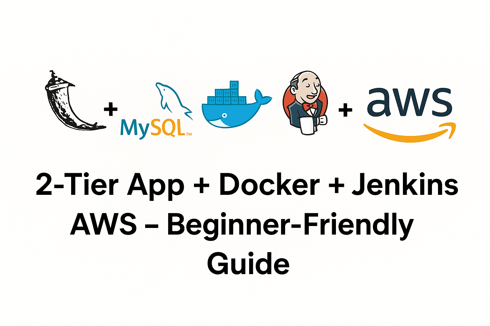

# Building a Real DevOps Project from Scratch: A Beginner-Friendly Walkthrough


### *— How a Simple 2-Tier Flask App Became a Full CI/CD + Docker + AWS Pipeline*

When I started working on this project, I wasn’t trying to build something “big.”
I simply wanted a clean, practical way to help beginners understand DevOps, not through theory, but through a **real, working cloud project**.

And that’s how this 2-Tier Flask + MySQL + Docker + Jenkins + AWS project began.

What it ended up becoming is much more than a demo app, it’s a complete end-to-end DevOps learning path.

---

### Table of Contents
- [🧠 First, What Are We Actually Building?](#first-what-are-we-actually-building)
- [🌩️ Understanding the DevOps Concepts (Beginner-Friendly Explanations)](#️understanding-the-devops-concepts-beginner-friendly-explanations)
- [🏗️ Architecture & CI/CD Pipeline](#architecture-simplified)
- [🚀 What a Beginner Learns](#what-a-beginner-learns)
- [🔍 Real Challenges You’ll Face](#real-challenges-youll-face)
- [🚀 Quick Start](#quick-start)
- [🎨 Customization](#customization)
- [📚 What’s Next?](#whats-next)
- [🤝 Contributing](#contributing)
- [🙏 Acknowledgments](#acknowledgments)


---

## First, What Are We Actually Building?

This project is a **2-Tier Web Application**:

### ✔️ Tier 1 → Flask Web App  
Handles UI, routing, and basic logic.

### ✔️ Tier 2 → MySQL Database  
Stores messages, data, and user inputs.

### ✔️ Both running as **Docker containers**  
(So there are no “it works on my machine” issues.)

And the entire thing is deployed automatically using:

- **Jenkins** for CI/CD  
- **AWS EC2** as the host  
- **GitHub** for version control  

---

## Understanding the DevOps Concepts (Beginner-Friendly Explanations)

### 🐳 **Docker (Containerization)**
**What it is:** A way to package your app and its environment into a portable unit.  
**Why it matters:** If it works inside a container, it will work anywhere.

### 🔄 **CI/CD with Jenkins**
**CI:** Auto-build on each code push  
**CD:** Auto-deploy to server  
**In this project:** Jenkins pulls code → builds Docker images → deploys on AWS.

### ☁️ **AWS EC2**
Your cloud server where everything runs.

### 📦 **Git + GitHub**
Version control + triggers Jenkins pipeline.

---

## Architecture (Simplified)

```
Developer → GitHub → Jenkins → Docker → AWS EC2 → Live App


+-----------------+      +----------------------+      +-----------------------------+
|   Developer     |----->|     GitHub Repo      |----->|        Jenkins Server       |
| (pushes code)   |      | (Source Code Mgmt)   |      |         (on AWS EC2)        |
+-----------------+      +----------------------+      |                             |
                                                       | 1. Clones Repo              |
                                                       | 2. Builds Docker Image      |
                                                       | 3. Runs Docker Compose      |
                                                       +--------------+--------------+
                                                                      |
                                                                      | Deploys
                                                                      v
                                                       +-----------------------------+
                                                       |      Application Server     |
                                                       |        (Same AWS EC2)       |
                                                       |                             |
                                                       | +-------------------------+ |
                                                       | | Docker Container: Flask | |
                                                       | +-------------------------+ |
                                                       |              |              |
                                                       |              v              |
                                                       | +-------------------------+ |
                                                       | | Docker Container: MySQL | |
                                                       | +-------------------------+ |
                                                       +-----------------------------+
```

*Architecture diagram generated with AI assistance*

---

## What a Beginner Learns

- Containerization  
- Docker Compose networking  
- CI/CD automation  
- Cloud deployment  
- Debugging pipelines  
- Security groups + networking  
- Real project structure  

---

## Real Challenges You’ll Face

- Jenkins not having Docker permissions  
- Database containers failing  
- Networking issues inside Docker  
- Wrong GitHub credentials  
- Security group misconfigurations  

These experiences teach faster than tutorials.

---

## 🛠️ Full Project Stack

- Python/Flask  
- MySQL  
- HTML/CSS/JS  
- Docker + Compose  
- Jenkins  
- AWS EC2  
- GitHub Webhooks  

---


## Quick Start

### 1️⃣ Server Setup 
1. Launch a EC2 Instance
   - 
2. Configure Security Group 
   - Allow ports 5000 (App), 8080 (Jenkins) in Inbound-Rules.
   - 
3. Connect to EC2 Instance 
`ssh -i /path/to/key.pem ubuntu@<ec2-public-ip>`

### 2️⃣ Environment Setup

1. Install Dependencies on EC2
- Update System Packages:
   `sudo apt update && sudo apt upgrade -y`

2. Install Git, Docker, and Docker Compose:
   `sudo apt install git docker.io docker-compose-v2 -y`

3. Start and Enable Docker:

   ```bash
   sudo systemctl enable docker
   sudo systemctl start docker
   ```
4. Add User to Docker Group (to run docker without sudo):
   ```bash
   sudo usermod -aG docker $USER
   newgrp docker
   ```

### 3️⃣ Jenkins Installation and Setup 

*[Installation docs - Official jenkins link](https://www.jenkins.io/doc/book/installing/linux/#debianubuntu)* 

1. Update the Debian apt repositories, install OpenJDK 21, and check the installation with the commands:
   ```bash
   sudo apt update
   sudo apt install fontconfig openjdk-21-jre
   java -version
   ```
2. Adding Jenkins Repository and Install:
   ```bash
   sudo wget -O /etc/apt/keyrings/jenkins-keyring.asc \
   https://pkg.jenkins.io/debian-stable/jenkins.io-2023.key
   echo "deb [signed-by=/etc/apt/keyrings/jenkins-keyring.asc]" \
   https://pkg.jenkins.io/debian-stable binary/ | sudo tee \
   /etc/apt/sources.list.d/jenkins.list > /dev/null
   sudo apt update
   sudo apt install jenkins
   ```
3. Enable and Start Jenkins:
   ```bash
   sudo systemctl enable jenkins
   sudo systemctl start jenkins
   sudo systemctl status jenkins
   ```
4. Access Jenkins:
   - Open your browser and navigate to `http://<ec2-public-ip>:8080`
   - Follow the on-screen instructions to unlock Jenkins using the initial admin password:
   ```bash
   sudo cat /var/lib/jenkins/secrets/initialAdminPassword
   ```
5. Install Suggested Plugins and Create Admin User.
6. Install **Pipeline: Stage View** plugin.
   - 

### 4️⃣ Jenkins Pipeline.

1. Create a New Pipeline Job in Jenkins:
   - From the Jenkins dashboard, select New Item.
   - Name the project, choose Pipeline, and click OK.

2. Configure the Pipeline:
   - In the configuration, provide description, 
   - Triggers select - GitHub hook trigger for GITScm polling
   - Setup a webhook on github
      - 
   - Pipeline: Pipeline script from SCM.
   - Choose Git as the SCM.
   - Enter your GitHub repository URL, add Credentials
   - In Branches to build, select your 
   - Verify the Script Path is Jenkinsfile.
   - Save the configuration.
   - 

3. Testing:
   - Initally click on **Build Now** from the left panel
   - You may encounter *Your pipeline failed because Jenkins does NOT have permission to access Docker*
      - This is the most common Jenkins + Docker error.
      - Run these commands on your Jenkins server:
      ```bash
      sudo usermod -aG docker jenkins
      sudo systemctl restart jenkins
      sudo systemctl restart docker
      ```
   - Now try again.


Open your browser and navigate to -> `http://your-ec2-ip:5000`

Confirm the containers are running on the EC2 instance with `docker ps`.

### Demo


## Customization

### Personalizing the Application

1. **Update Profile Information**
   ```html
   <!-- In templates/index.html -->
   <div class="name">Your Name</div>
   <div class="title">Your Title</div>
   <div class="bio">Your bio here...</div>
   ```

2. **Modify Tech Stack**
   ```html
   <!-- Add/remove tech tags -->
   <span class="tech-tag">Your Tech</span>
   ```

3. **Customize Styling**
   ```css
   /* In templates/index.html */
   /* Modify colors, fonts, animations */
   ```

---

## What’s Next?

- Add monitoring  
- Add load balancer  
- Move deployment to Kubernetes  
- Add Terraform for IaC  
- Add automated testing inside pipeline  

---
## Contributing

Contributions are welcome! Here's how you can help:

1. **Fork the repository**
2. **Create a feature branch**: `git checkout -b feature/amazing-feature`
3. **Commit your changes**: `git commit -m 'Add amazing feature'`
4. **Push to the branch**: `git push origin feature/amazing-feature`
5. **Open a Pull Request**

### Development Guidelines
- Follow PEP 8 for Python code
- Use meaningful commit messages
- Add comments for complex logic
- Test your changes locally
- Update documentation as needed

---

## 🙌 Final Note

> **DevOps is not about memorizing tools, it’s about understanding how systems connect.**

This project helps beginners experience that connection in a real, hands-on way.

## 🔗 GitHub Repository

👉 https://github.com/bHARATHaALETI018/2Tier_flask_app-Python-MySql-Jenkins-AWS-Docker.git

---
## Acknowledgments

- **Flask Community** for the amazing web framework
- **Docker** for containerization technology
- **AWS** for reliable cloud infrastructure
- **Jenkins** for CI/CD automation
- **Open Source Community** for inspiration and tools

## 📞 Contact & Support

**Bharath Aaleti**
- 💼 DevOps Engineer
- 🌐 LinkedIn: [Connect with me](https://linkedin.com/in/bharathaaleti)
- 📧 Email: aaletibharath@gmail.com
- 🐙 GitHub: [@bHARATHaALETI018](https://github.com/bHARATHaALETI018/)

---

<div align="center">

**⭐ If you found this project helpful, share your thoughts, experience, I would really appreciate a LIKE**

*Built with ❤️ by Bharath Aaleti*

</div>

---